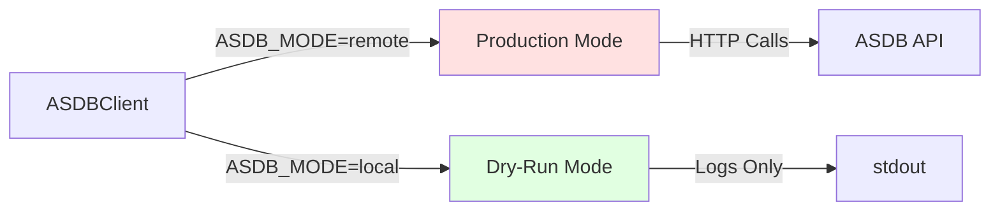
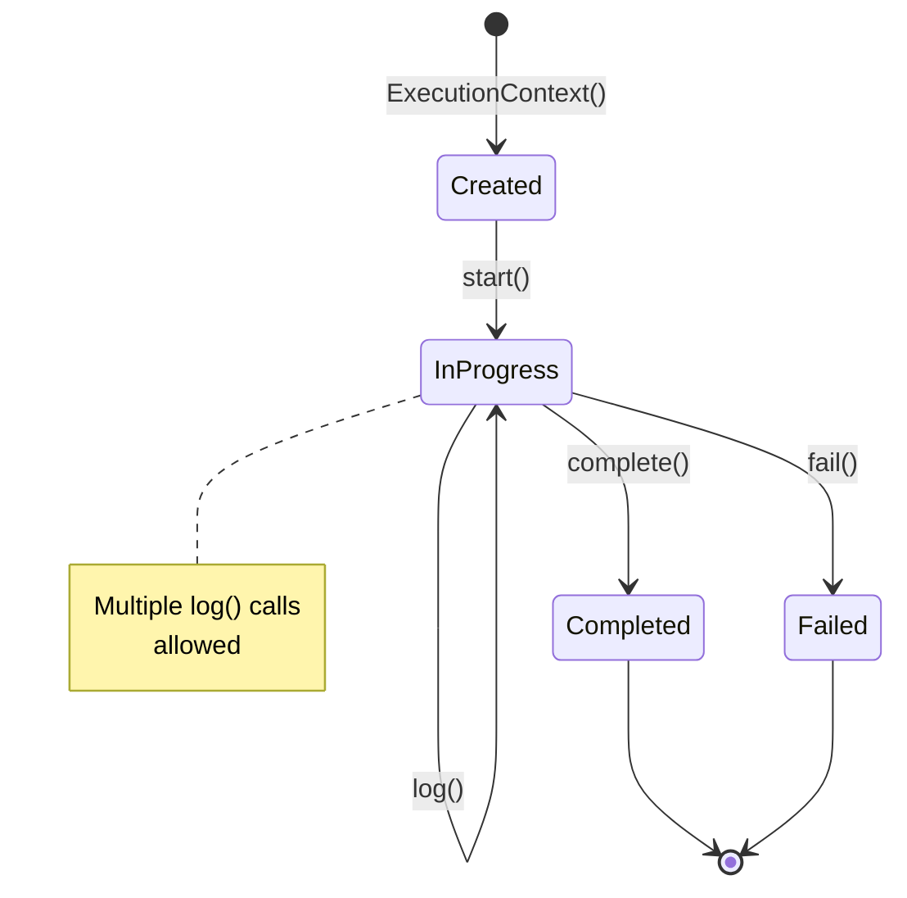

# swimlib Developer Guides

[](GUIDES.md)
[](EXAMPLES.md)

Comprehensive guides for developing with swimlib SDK.

---

## Table of Contents

- [Getting Started](#-getting-started)
- [Configuration Guide](#-configuration-guide)
- [Client Initialization](#-client-initialization)
- [Execution Context](#-execution-context)
- [Error Handling](#-error-handling)
- [Logging](#-logging)
- [Testing Strategies](#-testing-strategies)
- [Best Practices](#-best-practices)

---

## 🚀 Getting Started

### Prerequisites

```bash
# System requirements
Python >= 3.13
Poetry >= 2.0.0
```

### Installation

```bash
# Clone the repository
git clone https://github.com/yourusername/swimlib.git
cd swimlib

# Install dependencies
poetry install

# Verify installation
poetry run python -c "from swimlib.asdb import ASDBClient; print('✓ swimlib installed')"
```

### Project Structure

```
swimlib/
├── swimlib/
│   ├── __init__.py          # Logger configuration
│   ├── asdb.py              # Core SDK implementation
│   ├── f5/                  # F5 BIG-IP specific modules
│   ├── netscaler/           # Citrix NetScaler modules
│   └── paloalto/            # Palo Alto modules
├── pyproject.toml           # Poetry configuration
├── README.md                # Main documentation
├── CLAUDE.md                # AI assistant instructions
├── GUIDES.md                # This file
└── EXAMPLES.md              # Code examples
```

---

## ⚙️ Configuration Guide

### Environment Variables

> [!IMPORTANT]
> swimlib reads configuration exclusively from environment variables. No config files are supported.

#### Required Variables

| Variable | Description | Example |
|----------|-------------|---------|
| `ASDB_BASE_URL` | ASDB API endpoint | `https://asdb.company.com` |
| `ASDB_TOKEN` | Authentication token | `eyJhbGc...` |

#### Optional Variables

| Variable | Default | Options | Description |
|----------|---------|---------|-------------|
| `ASDB_MODE` | `remote` | `remote`, `local` | API interaction mode |
| `SWIMLIB_LOG_LEVEL` | `INFO` | `DEBUG`, `INFO`, `WARNING`, `ERROR` | Logging verbosity |

### Configuration Methods

<details>
<summary><strong>Method 1: Shell Environment</strong></summary>

```bash
export ASDB_BASE_URL="https://asdb.company.com"
export ASDB_TOKEN="your-token-here"
export ASDB_MODE="remote"
export SWIMLIB_LOG_LEVEL="INFO"
```

</details>

<details>
<summary><strong>Method 2: .env File (Development)</strong></summary>

Create `.env` in your project root:

```bash
ASDB_BASE_URL=https://asdb.company.com
ASDB_TOKEN=your-token-here
ASDB_MODE=local
SWIMLIB_LOG_LEVEL=DEBUG
```

Load with python-dotenv:

```python
from dotenv import load_dotenv
load_dotenv()

from swimlib.asdb import ASDBClient
client = ASDBClient.from_env()
```

</details>

<details>
<summary><strong>Method 3: CI/CD Secrets</strong></summary>

**GitHub Actions:**
```yaml
env:
  ASDB_BASE_URL: ${{ secrets.ASDB_BASE_URL }}
  ASDB_TOKEN: ${{ secrets.ASDB_TOKEN }}
  ASDB_MODE: remote
```

**GitLab CI:**
```yaml
variables:
  ASDB_MODE: remote

script:
  - export ASDB_BASE_URL=$ASDB_BASE_URL
  - export ASDB_TOKEN=$ASDB_TOKEN
```

</details>

> [!WARNING]
> Never commit `.env` files or hardcode tokens in source code. Use secret management systems in production.

---

## 🔌 Client Initialization

### Basic Initialization

```python
from swimlib.asdb import ASDBClient, ASDBError

try:
    # Reads from environment variables
    client = ASDBClient.from_env()
except ASDBError as e:
    print(f"Failed to initialize client: {e}")
    sys.exit(1)
```

### Operation Modes



#### Remote Mode (Production)

```python
# Set environment
os.environ['ASDB_MODE'] = 'remote'

client = ASDBClient.from_env()
# Makes actual HTTP calls to ASDB API
client.update_execution_log_status(log_id, "in_progress")
```

**Use when:**
- Running production workflows
- Need actual ASDB integration
- Tracking real device operations

#### Local Mode (Testing)

```python
# Set environment
os.environ['ASDB_MODE'] = 'local'

client = ASDBClient.from_env()
# Only logs the request, no HTTP calls
client.update_execution_log_status(log_id, "in_progress")
# Output: [INFO] Would update execution log 123 to in_progress
```

**Use when:**
- Developing new features
- Testing workflows locally
- Validating logic without side effects

---

## 🎯 Execution Context

### Lifecycle Management



### Creating a Context

```python
from swimlib.asdb import ExecutionContext

ctx = ExecutionContext(
    client=client,
    device_name="fw-01.prod.company.com",
    execution_id="exec-2026-001",
    execution_log_id="log-456",
    execution_type="production"  # or "dry_run"
)
```

#### Parameters Explained

| Parameter | Type | Description |
|-----------|------|-------------|
| `client` | `ASDBClient` | Initialized client instance |
| `device_name` | `str` | FQDN or identifier of target device |
| `execution_id` | `str` | Unique execution identifier from ASDB |
| `execution_log_id` | `str` | Log stream identifier from ASDB |
| `execution_type` | `str` | `"production"` or `"dry_run"` |

### Execution Types

#### Production Execution

```python
ctx = ExecutionContext(
    client=client,
    device_name="router-01",
    execution_id="exec-123",
    execution_log_id="log-456",
    execution_type="production"
)

# Creates device history records
ctx.complete("Success", metadata)
```

**Behavior:**
- ✅ Creates device history in ASDB
- ✅ Full status tracking
- ✅ Persistent logging

#### Dry-Run Execution

```python
ctx = ExecutionContext(
    client=client,
    device_name="router-01",
    execution_id="exec-123",
    execution_log_id="log-456",
    execution_type="dry_run"
)

# Skips device history creation
ctx.complete("Success", metadata)
```

**Behavior:**
- ❌ No device history created
- ✅ Status updates still sent
- ✅ Logging still active

---

## 🛡️ Error Handling

### Exception Hierarchy

```python
Exception
└── ASDBError (swimlib.asdb)
    ├── Configuration errors
    ├── API communication errors
    └── Validation errors
```

### Error Handling Patterns

#### Pattern 1: Fail Fast

```python
from swimlib.asdb import ASDBClient, ASDBError
import sys

try:
    client = ASDBClient.from_env()
    ctx = ExecutionContext(...)
    ctx.start()
    # ... operations ...
    ctx.complete("Done", metadata)

except ASDBError as e:
    print(f"Error: {e}")
    sys.exit(1)
```

> [!TIP]
> Use this pattern for CLI applications where any error should terminate the process.

#### Pattern 2: Graceful Degradation

```python
from swimlib.asdb import ASDBClient, ASDBError
from swimlib import log

try:
    client = ASDBClient.from_env()
    ctx = ExecutionContext(...)

    try:
        ctx.start()
    except ASDBError as e:
        log.warning(f"Failed to update ASDB status: {e}")
        log.info("Continuing with local execution only")

    # ... continue operations ...

except ASDBError as e:
    log.error(f"Fatal error: {e}")
    return None
```

> [!TIP]
> Use this pattern when ASDB integration is optional and local operations can continue independently.

#### Pattern 3: Retry Logic

```python
import time
from swimlib.asdb import ASDBClient, ASDBError

def with_retry(func, max_attempts=3, delay=2):
    """Retry helper for transient failures."""
    for attempt in range(max_attempts):
        try:
            return func()
        except ASDBError as e:
            if attempt == max_attempts - 1:
                raise
            log.warning(f"Attempt {attempt + 1} failed: {e}")
            time.sleep(delay)

# Usage
with_retry(lambda: ctx.start())
```

### Common Error Scenarios

<details>
<summary><strong>Missing Environment Variables</strong></summary>

```python
# Error
ASDBError: ASDB_BASE_URL environment variable is required

# Solution
export ASDB_BASE_URL="https://asdb.company.com"
export ASDB_TOKEN="your-token"
```

</details>

<details>
<summary><strong>API Authentication Failure</strong></summary>

```python
# Error
ASDBError: API request failed: 401 Unauthorized

# Solution
# Verify token is valid and not expired
export ASDB_TOKEN="new-valid-token"
```

</details>

<details>
<summary><strong>Network Connectivity Issues</strong></summary>

```python
# Error
ASDBError: API request failed: Connection timeout

# Solution
# 1. Check network connectivity
# 2. Verify ASDB_BASE_URL is reachable
# 3. Use local mode for testing
export ASDB_MODE="local"
```

</details>

---

## 📊 Logging

### Logger Configuration

```python
from swimlib import log

# Logger is pre-configured with RichHandler
log.info("Application started")
log.debug("Detailed debug information")
log.warning("Warning message")
log.error("Error occurred")
```

### Log Levels

| Level | When to Use | Example |
|-------|-------------|---------|
| `DEBUG` | Detailed diagnostic info | Variable values, API responses |
| `INFO` | General informational messages | Operation progress, status updates |
| `WARNING` | Warning messages | Degraded operation, retries |
| `ERROR` | Error messages | Operation failures |

### Controlling Verbosity

```bash
# Detailed debugging
export SWIMLIB_LOG_LEVEL=DEBUG

# Production logging
export SWIMLIB_LOG_LEVEL=INFO

# Quiet mode
export SWIMLIB_LOG_LEVEL=ERROR
```

### Dual Logging

ExecutionContext automatically logs to both local stdout and ASDB:

```python
ctx = ExecutionContext(...)
ctx.start()

# Logs to both console and ASDB
ctx.log("Starting device connection", "info")
ctx.log("Connected successfully", "info")
```

> [!NOTE]
> If ASDB logging fails, the error is logged locally but execution continues. This ensures local operations aren't blocked by remote logging failures.

---

## 🧪 Testing Strategies

### Unit Testing with Local Mode

```python
import os
import pytest
from swimlib.asdb import ASDBClient, ExecutionContext

@pytest.fixture
def local_client():
    """Fixture providing a local-mode client."""
    os.environ['ASDB_MODE'] = 'local'
    os.environ['ASDB_BASE_URL'] = 'https://test.example.com'
    os.environ['ASDB_TOKEN'] = 'test-token'
    return ASDBClient.from_env()

def test_execution_lifecycle(local_client):
    """Test complete execution lifecycle."""
    ctx = ExecutionContext(
        client=local_client,
        device_name="test-device",
        execution_id="test-exec",
        execution_log_id="test-log",
        execution_type="dry_run"
    )

    # These will only log, not make HTTP calls
    ctx.start()
    ctx.log("Test message")
    ctx.complete("Test complete", {})

    # Add assertions as needed
```

### Integration Testing

```python
import pytest
from swimlib.asdb import ASDBClient, ASDBError

@pytest.mark.integration
def test_real_api_connection():
    """Test actual API connectivity (requires credentials)."""
    try:
        client = ASDBClient.from_env()
        # Test actual API call
        # Add specific integration test logic
    except ASDBError as e:
        pytest.fail(f"API connection failed: {e}")
```

### Mocking ASDB API

```python
from unittest.mock import Mock, patch
from swimlib.asdb import ExecutionContext

def test_with_mock():
    """Test using mocked client."""
    mock_client = Mock()

    ctx = ExecutionContext(
        client=mock_client,
        device_name="test-device",
        execution_id="exec-1",
        execution_log_id="log-1",
        execution_type="production"
    )

    ctx.start()

    # Verify mock was called
    mock_client.update_execution_log_status.assert_called_once()
```

---

## ✨ Best Practices

### 1. Always Use Environment Variables

```python
# ✅ Good - Configuration from environment
client = ASDBClient.from_env()

# ❌ Bad - Hardcoded values
client = ASDBClient(
    base_url="https://asdb.company.com",
    api_token="hardcoded-token"  # Security risk!
)
```

### 2. Use ExecutionContext for Workflows

```python
# ✅ Good - Automatic lifecycle management
ctx = ExecutionContext(...)
ctx.start()
ctx.log("Working...")
ctx.complete("Done", metadata)

# ❌ Bad - Manual status management
client.update_execution_log_status(log_id, "in_progress")
client.append_log(log_id, "Working...", "info")
client.update_execution_log_status(log_id, "completed")
```

### 3. Handle Errors Appropriately

```python
# ✅ Good - Let CLI handle exit
try:
    ctx.start()
except ASDBError as e:
    print(f"Error: {e}")
    sys.exit(1)

# ❌ Bad - Library shouldn't exit
def library_function():
    try:
        ctx.start()
    except ASDBError:
        sys.exit(1)  # Don't do this in library code!
```

### 4. Use Local Mode for Development

```bash
# Development
export ASDB_MODE=local

# Production
export ASDB_MODE=remote
```

### 5. Use Dry-Run for Validation

```python
# First validate with dry-run
ctx = ExecutionContext(..., execution_type="dry_run")
ctx.start()
validate_configuration()
ctx.complete("Validation passed", {})

# Then run production
ctx = ExecutionContext(..., execution_type="production")
perform_actual_work()
```

### 6. Structured Metadata

```python
from swimlib.asdb import build_upgrade_metadata

# ✅ Good - Use builder function
metadata = build_upgrade_metadata(
    target_version="18.1.0",
    local_folder="/images",
    remote_folder="/var/images"
)

# ❌ Bad - Manual dict construction
metadata = {
    "version": "18.1.0",  # Inconsistent keys
    "path": "/images"      # Missing fields
}
```

### 7. Descriptive Device Names

```python
# ✅ Good - FQDN or clear identifier
device_name = "fw-01.prod.datacenter1.company.com"

# ❌ Bad - Ambiguous names
device_name = "firewall"
```

### 8. Meaningful Log Messages

```python
# ✅ Good - Actionable information
ctx.log("Uploading image to /var/images (234MB, ETA 3min)", "info")

# ❌ Bad - Vague messages
ctx.log("Working...", "info")
```

---

## 📚 Additional Resources

- [Examples](EXAMPLES.md) - Code examples and use cases
- [CLAUDE.md](CLAUDE.md) - Architecture deep dive
- [README.md](README.md) - Quick start guide

---

> [!TIP]
> For specific code examples and use cases, see [EXAMPLES.md](EXAMPLES.md).

---

<div align="center">

**Questions or feedback?** Open an issue on GitHub

</div>
