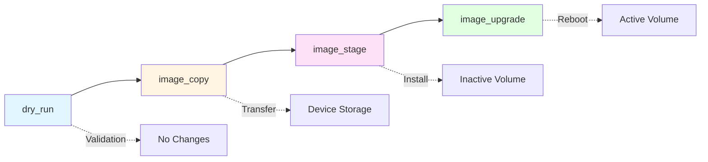
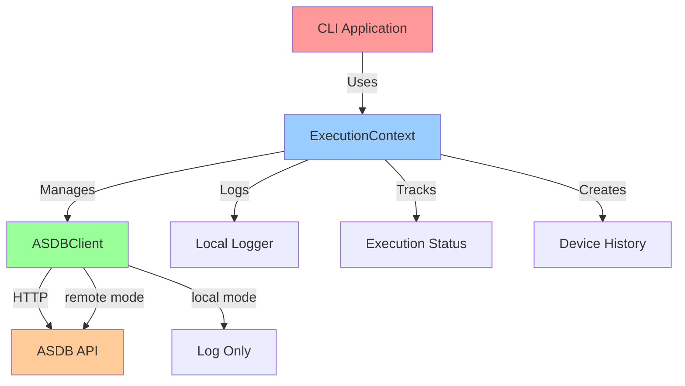

# swimlib

[](https://www.python.org/downloads/)
[](https://github.com/yourusername/swimlib)
[](LICENSE)
[](https://python-poetry.org/)

Production-grade Python SDK for automating F5 BIG-IP device upgrades via ASDB API.

---

## Features

- **Image Copy**: SFTP transfer with MD5 validation
- **Image Stage**: Install software to inactive volume
- **Image Upgrade**: Reboot to upgraded volume
- **ASDB Integration**: Execution tracking, logging, and status updates

---

## 🚀 Quick Start

```bash
# Install dependencies
poetry install

# Build package
poetry build
```

---

## 🔧 Environment Variables

> [!IMPORTANT]
> All environment variables must be configured before running swimlib operations.

```bash
ASDB_BASE_URL=https://asdb.example.com
ASDB_TOKEN=your_token
ASDB_MODE=remote              # or 'local' for dry-run
SWIMLIB_LOG_LEVEL=INFO        # DEBUG, INFO, WARNING, ERROR
```

<details>
<summary>Environment Variable Details</summary>

| Variable | Required | Default | Description |
|----------|----------|---------|-------------|
| `ASDB_BASE_URL` | ✅ Yes | - | Base URL for ASDB API endpoint |
| `ASDB_TOKEN` | ✅ Yes | - | API authentication token |
| `ASDB_MODE` | ❌ No | `remote` | Operation mode (`remote` or `local`) |
| `SWIMLIB_LOG_LEVEL` | ❌ No | `INFO` | Logging verbosity level |

</details>

---

## 📖 Usage

### Basic Example

```python
from swimlib.asdb import ASDBClient, ExecutionContext

# Initialize client from environment
client = ASDBClient.from_env()

# Create execution context
ctx = ExecutionContext(
    client=client,
    device_name="router-01",
    execution_id="exec-123",
    execution_log_id="log-456",
    execution_type="production"
)

# Execute workflow
ctx.start()
ctx.log("Starting upgrade...")
# ... perform upgrade operations ...
ctx.complete("Upgrade complete", metadata)
```

### Advanced: Custom Metadata

```python
from swimlib.asdb import build_upgrade_metadata

metadata = build_upgrade_metadata(
    target_version="18.1.0",
    local_folder="/local/images",
    remote_folder="/var/images"
)

ctx.complete("Upgrade successful", metadata)
```

> [!WARNING]
> Library raises `ASDBError` exceptions - **never calls `sys.exit()`**. CLI applications must handle process termination.

---

## 🔄 Workflow Modes



| Mode | Description | Actions |
|------|-------------|---------|
| `dry_run` | Pre-validation only | Validates configuration without changes |
| `image_copy` | Copy artifacts to device | SFTP transfer + MD5 validation |
| `image_stage` | Copy + install to inactive volume | Transfer → Install (no reboot) |
| `image_upgrade` | Copy + install + reboot | Full upgrade cycle |

---

## Architecture



### Core Components

<details>
<summary><strong>ASDBClient</strong> - Low-level HTTP client</summary>

**Location**: [swimlib/asdb.py](swimlib/asdb.py#L14-L174)

**Purpose**: Low-level HTTP client for ASDB API operations

**Modes**:
- `remote`: Makes actual API calls (production)
- `local`: Logs requests without HTTP calls (testing/dry-run)

**Key Methods**:
- `update_execution_log_status()` - Update execution status
- `append_log()` - Send log entries to ASDB
- `update_device_status()` - Update device connection status
- `create_device_history()` - Create history records

</details>

<details>
<summary><strong>ExecutionContext</strong> - High-level orchestrator</summary>

**Location**: [swimlib/asdb.py](swimlib/asdb.py#L177-L298)

**Purpose**: Orchestrates execution lifecycle management

**Workflow**: `start()` → `log()` → `complete()` or `fail()`

**Key Methods**:
- `start()` - Mark execution as in-progress
- `log(message, level)` - Log locally and to ASDB
- `complete(message, metadata)` - Successful completion
- `fail(message, metadata)` - Mark as failed and raise error

</details>

> [!TIP]
> Use `ExecutionContext` in CLI scripts rather than calling `ASDBClient` directly for automatic lifecycle management.

---

## 🛡️ Error Handling

```python
from swimlib.asdb import ASDBClient, ASDBError
import sys

try:
    client = ASDBClient.from_env()
    # ... perform operations ...

except ASDBError as e:
    # Library raises exceptions - CLI handles exit
    print(f"❌ Error: {e}")
    sys.exit(1)
```

> [!NOTE]
> All ASDB operations raise `ASDBError` on failure. This allows CLI applications to decide how to handle termination.

---

## 📚 Documentation

For detailed architecture and development guidance, see [CLAUDE.md](CLAUDE.md).

### Additional Resources

- [ASDB API Documentation](https://asdb.example.com/docs)
- [F5 BIG-IP Upgrade Guide](https://support.f5.com)

---

## 📝 License

MIT License - see [LICENSE](LICENSE) for details.

---

<div align="center">

**Built with** ❤️ **using Python & Poetry**

</div>
